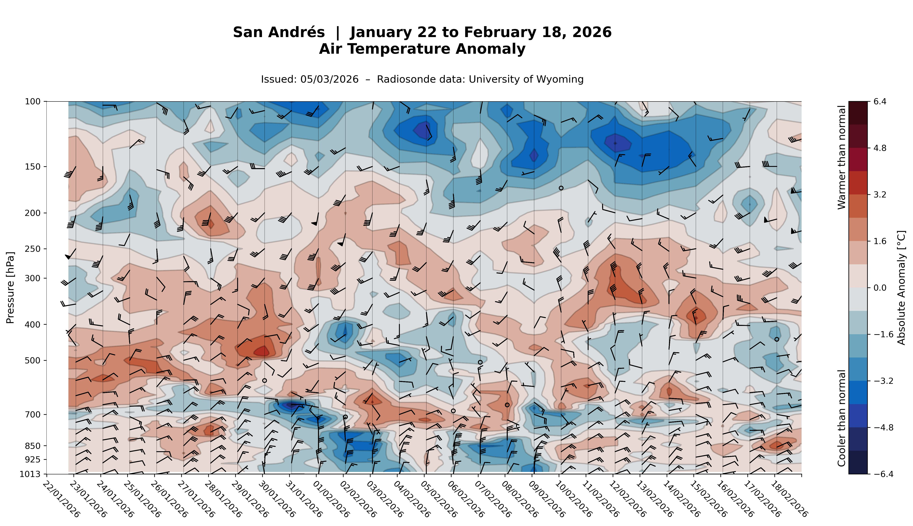

# Radiosonde Vertical Profile Evolution

Author: David Garzón Casas (dgarzonc@unal.edu.co)  - March 2026

---

Hovmöller-style time–pressure diagrams of upper-air radiosonde data over a
configurable time window. The script downloads soundings from the
[University of Wyoming Upper Air Archive](http://weather.uwyo.edu/upperair/sounding.html),
interpolates them onto a regular 5 hPa pressure grid, and plots the temporal
evolution of temperature, wind components, relative humidity, equivalent
potential temperature, and their climatological anomalies.

Climatologies used for the anomaly fields are produced by the companion
repository
[radiosonde_climatology_analysis](https://github.com/dgarzonc/radiosonde_climatology_analysis)
and copied manually into `data/climatology/`.

---

## Installation

```bash
git clone https://github.com/dgarzonc/radiosonde_profile_evolution.git
cd radiosonde_profile_evolution
pip install -r requirements.txt
```

---

## Usage

```bash
python radiosonde_profile_evolution.py
```

---

## Modes and Parameters

### Run mode — `MODE`

| Value | Description |
|-------|-------------|
| `'last_days'` | Processes the most recent `N_DAYS` days ending at today's 12 UTC. Ideal for near-real-time monitoring. |
| `'historical'` | Processes a fixed date range defined by `hist_start_date` and `hist_end_date`. Ideal for case studies. |

```python
MODE   = 'last_days'
N_DAYS = 22            # number of days shown in 'last_days' mode

# Only used when MODE == 'historical'
hist_start_date = datetime(2025, 11,  1, 12, 0)
hist_end_date   = datetime(2026,  2, 15, 12, 0)
```

### Active stations — `active_stations`

List of Wyoming station codes to process in a given run:

```python
active_stations = ['SKBO', 'SKSP', 'SKLT']
```

### Other parameters

| Parameter | Description |
|-----------|-------------|
| `UTC_OFFSET` | Local time offset from UTC (hours). Colombia: `–5`. Used to position soundings on the local-time x-axis. |
| `REDOWNLOAD_DAYS` | Number of most-recent days whose raw files are always re-downloaded and re-interpolated, even if they exist on disk. Covers the case where Wyoming updates a sounding with corrected data. Default: `3`. |

---

## Output Plots

Nine Hovmöller diagrams are generated per station inside `figures/<station>/`:

| File | Variable |
|------|----------|
| `1_temperature.jpg` | Air temperature |
| `2_speed.jpg` | Wind speed |
| `3_u_wind.jpg` | Zonal wind component (U) |
| `4_v_wind.jpg` | Meridional wind component (V) |
| `5_rh.jpg` | Relative humidity |
| `6_ept.jpg` | Equivalent potential temperature |
| `7_anom_temperature.jpg` | Temperature anomaly |
| `8_anom_rh.jpg` | Relative humidity anomaly |
| `9_anom_ept.jpg` | Equivalent potential temperature anomaly |

---

## Data Sources

**Daily soundings** are downloaded automatically from the
[University of Wyoming Upper Air Archive](http://weather.uwyo.edu/upperair/sounding.html).
No manual download is required.

**Climatologies** (daily-smoothed, pressure-level means for each variable) are
computed by the companion repository
**[radiosonde_climatology_analysis](https://github.com/dgarzonc/radiosonde_climatology_analysis)**.
After running that workflow, copy the resulting CSV files into
`data/climatology/<station_folder>/`. Anomaly plots will not render if the
climatology files are absent.

---

## Adding a New Station

1. Find the Wyoming station code (e.g. `SKBO`, `SKBQ`).
2. Add an entry to the `STATIONS` dictionary:

```python
STATIONS = {
    ...
    'SKBQ': {
        'display_name':      'Barranquilla',
        'folder_label':      'SKBQ_Barranquilla',   # must match climatology folder
        'download_hours':    [12],
        'valid_hours':       [12],
        'plot_offset_hours': 12,
    },
}
```

3. Include the code in `active_stations`:

```python
active_stations = ['SKBO', 'SKBQ']
```

4. Generate the climatology CSVs using
   [radiosonde_climatology_analysis](https://github.com/dgarzonc/radiosonde_climatology_analysis)
   and place them in `data/climatology/SKBQ_Barranquilla/`.

---

## Example — Cold-Front Passages over San Andrés (January–February 2026)

> **Station: San Andrés (SKSP) · Dates: January 22 to February 18, 2026**

The air temperature anomaly diagram below captures two distinct cold-front
passages over San Andrés Island during this period.



The fronts are identifiable on approximately **January 30** and **February 5**,
each leaving a clear signal of cooler-than-normal air in the low troposphere
that persists for roughly **5 days** after each passage before gradually
returning to near-climatological values.

The equivalent potential temperature anomaly plot (`9_anom_ept.jpg`, available
in the repository figures) further shows the significant atmospheric
instabilities produced by these frontal systems, reflecting the enhanced
convective potential associated with each cold air intrusion.

---

## License

This project is released for scientific and educational use.
Please cite or acknowledge the author if you use this code in your work.
